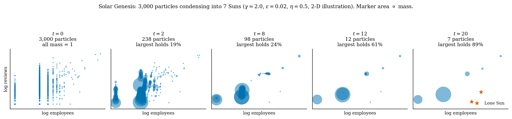
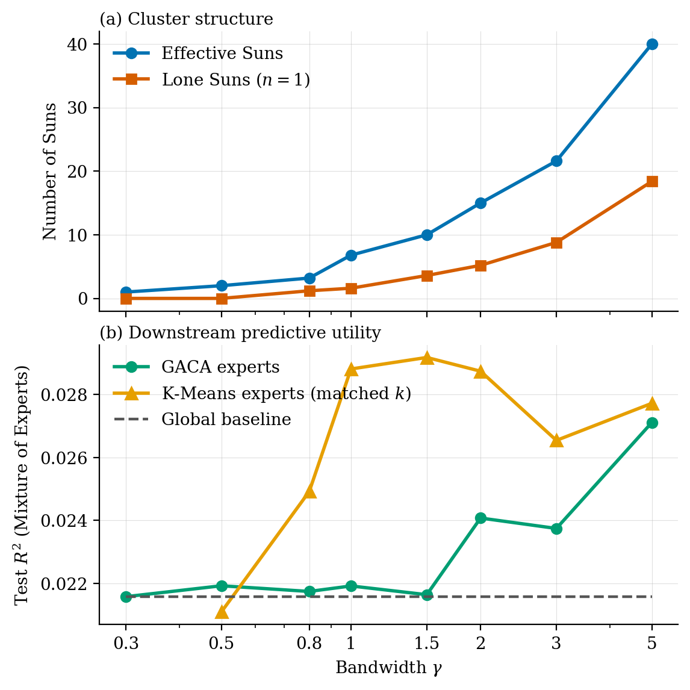
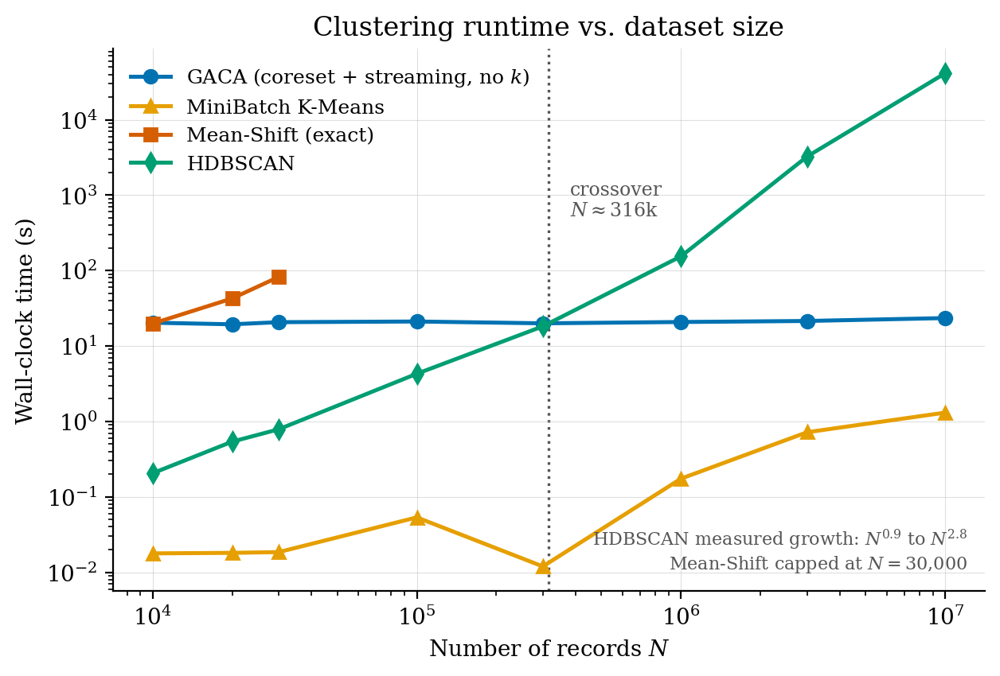

# GACA: Gravitational Accretion Clustering Algorithm

GACA is a density-based clustering method that treats every data point as a
particle with mass. Nearby mass attracts, particles drift towards dense regions,
and particles that meet merge and keep their combined mass. What is left are the
**Suns**: the cluster centres. You never specify the number of clusters. It
emerges from the dynamics and is controlled by one bandwidth parameter, γ.

GACA is designed for large tables. The expensive simulation runs once on a small
random sample (the coreset), and the full dataset is then streamed through the
resulting Suns in batches. In the thesis experiments this clustered **10 million
records in about 23 seconds on a laptop, with constant memory**.

This repository contains the reference implementation from the master's thesis
*The Gravitational Accretion Clustering Algorithm (GACA): Scalable,
Physics-Inspired Clustering for Large Datasets*.



## How it works

**Phase 1: Solar Genesis (structure discovery on a coreset).** A uniform sample of
`sample_size` rows (5,000 by default) starts as particles of mass 1. Each
iteration:

1. **Transport.** Every particle moves a damped step (η) towards the mass-weighted
   Gaussian average of its surroundings. This is exactly a blurring mean-shift
   step: the displacement equals `(1 / 2γ) ∇ log KDE(x)`.
2. **Condensation.** Particles closer than ε are linked, and each connected
   component is replaced by one particle at its centre of mass, carrying the
   summed mass. Mass is conserved exactly.

A Barnes-Hut tree (a KD-tree whose nodes cache total mass and centre of mass)
treats distant groups of particles as single bodies, so an iteration costs about
O(n log n) instead of O(n²). Genesis stops at a stable plateau or at the
iteration cap. The surviving particles are the Suns.

**Phase 2: Particle Accretion (assignment of every row).** Each row is assigned
to the Sun with the strongest pull, `M_k / d²`. This is O(N) time, and because it
works batch by batch, memory depends on the batch size rather than on N. The
Suns themselves never change after genesis.

**Lone Suns (anomalies).** A point far from everything feels essentially no
Gaussian pull, never moves and never merges. It survives as a Sun of mass 1: a
Lone Sun. Anomaly isolation is a side effect of the same dynamics, not a
separate detector.

## Installation

```bash
git clone https://github.com/<your-user>/GACA.git
cd GACA
pip install -e .                  # core: numpy, scipy, scikit-learn
pip install -e ".[experiments]"   # + pandas, matplotlib, hdbscan, lightgbm, ...
pip install -e ".[dev]"           # + pytest
```

Python 3.9 or newer.

## Quickstart

```python
import numpy as np
from sklearn.preprocessing import StandardScaler
from gaca import GACA

X = StandardScaler().fit_transform(X_raw)   # standardise first

model = GACA(gamma_clustering=1.0, random_state=0).fit(X)
labels = model.assign(X)                    # Sun index for every row

model.suns_          # (k, d) Sun positions
model.sun_masses_    # (k,) mass each Sun accumulated from the coreset
lone_suns = np.flatnonzero(model.sun_masses_ == 1)
```

A runnable demo on synthetic data (five groups plus planted anomalies, compared
with K-Means):

```bash
python examples/quickstart.py
```

### Streaming data larger than memory

`fit` only needs the coreset, and `assign` works on any batch, so a large file
can be processed chunk by chunk:

```python
model = GACA(random_state=0).fit(coreset)          # e.g. 5,000 sampled rows
for chunk in pd.read_csv("big.csv", chunksize=100_000):
    labels = model.assign(scaler.transform(chunk[features].values))
```

### Mixture of Experts

Passing a target to `fit` trains one Ridge regression per Sun (logistic
regression with `task_type='classification'`). `predict` routes each row to its
Sun's expert. Suns with fewer than `min_expert_size` training rows predict their
mean, and empty Suns fall back to a global model.

```python
model = GACA(random_state=0).fit(X_train, y_train)
y_pred = model.predict(X_test)
```

## Parameters

| Parameter | Default | Meaning |
|---|---|---|
| `gamma_clustering` | 1.0 | Gaussian bandwidth γ. The main dial: low γ merges everything into one Sun, high γ fragments into many |
| `epsilon` | 0.05 | Condensation radius ε. Has little effect on structure; larger is faster |
| `eta` | 0.5 | Damping η of the transport step |
| `sample_size` | 5000 | Coreset size for Solar Genesis |
| `n_iterations` | 20 | Iteration cap for genesis |
| `theta` | 0.5 | Barnes-Hut opening angle. Larger is faster and less exact |
| `min_expert_size` | 10 | Minimum rows for a Sun to get its own regression expert |
| `random_state` | None | Seed for the coreset draw |
| `verbose` | False | Print progress |

The lower-level functions are also exported: `solar_genesis` (the simulation on
its own), `assign` (Newtonian assignment given Suns and masses), `GACANode` and
`merge_connected_components`.

## Practical guidance

- **Standardise your features.** γ and ε are defined on a standardised scale.
- **Keep dimensionality low.** The Barnes-Hut tree stops helping above roughly
  15 dimensions, and clustering quality collapses with it. Project to about 5
  dimensions with PCA first. In the thesis, 45 raw dimensions took over an hour
  and shattered into 1,377 singletons; PCA to 5 dimensions took 33 seconds.
- **Choose γ from the plateau.** Sweep γ and pick a value where the Sun count is
  stable. γ = 1.0 sat in the stable band on the thesis data.
- **Use it at scale.** GACA's cost is dominated by a fixed genesis step (about
  20 seconds in pure Python), so below a few hundred thousand rows HDBSCAN is
  faster. The advantage appears at large N.
- **Anomalies need to be in the coreset to become Lone Suns.** An anomaly that is
  not sampled is assigned to its strongest-pull Sun. To catch those, flag rows
  whose distance to their Sun exceeds that Sun's 95th percentile training
  distance (the OOD rule used in the thesis; see `experiments/anomaly_recovery.py`).
- **Pure Python.** The tree traversal is not compiled, so genesis on very large
  coresets is slow. This is the most obvious place for a speed-up.

## Results from the thesis

| | Result |
|---|---|
| Scalability | 10⁷ records: 23.5 s total, 0.81 µs per record for assignment, peak memory flat at 707 MB |
| vs HDBSCAN | 1,766× faster at 10⁷ records; HDBSCAN is faster below ~3×10⁵ |
| Structure | Largest-Sun share 0.9203 to 0.9209 while streaming from 10⁵ to 10⁷ records |
| Fragmentation | 5 effective clusters vs 91 (HDBSCAN) and 94 (Mean-Shift) on 20k records |
| Anomalies | 92% of sampled planted anomalies isolated as Lone Suns; 100% of unsampled ones flagged by the OOD rule |
| Robustness | Under heavy feature noise (σ = 2), a K-Means mixture fell to R² = −0.004 while the GACA mixture kept 0.012 |





## Repository layout

```
gaca/            the package: Solar Genesis, assignment, GACA estimator
tests/           pytest suite (mass conservation, Lone Suns, estimator)
examples/        runnable demo on synthetic data
experiments/     the scripts behind every thesis table and figure
figures/         images used in this README
data/            empty; put your own data here (git-ignored)
```

## Reproducing the thesis experiments

The thesis used proprietary company data, which is not included. The scripts in
`experiments/` run on any CSV with the columns below. Run them from the
repository root; outputs (CSV, PDF, PNG) are written to the current directory.

The company-data loader (`experiments/process_data.py`) builds five features:

| Feature | Built from |
|---|---|
| `log_emp` | `EMPLOYEES_COUNT`, falling back to the midpoint of the `SIZE` band (`1-10`, `11-50`, ...) |
| `log_reviews` | `TOTAL_GMAPS_REVIEW_COUNT` |
| `age` | `FOUNDED` (year) |
| `LATITUDE`, `LONGITUDE` | as is |

The regression target is `GMAPS_REVIEWS_AVERAGE`. The characterisation scripts
also use `NAME`, `GMAPS_PRIMARY_CATEGORY`, `INDUSTRY` and `COUNTRY` when present.
The dimensionality experiment accepts any wide table of numeric columns.

| Script | Thesis result |
|---|---|
| `sweep_gamma.py` → `plot_phase_transition.py` | γ phase transition (Sec. 5.1) |
| `sweep_epsilon.py` | ε sensitivity |
| `benchmark_clustering.py` | GACA vs K-Means, Mean-Shift, HDBSCAN (Table 5.4) |
| `final_benchmark_test.py` | Mixture of Experts under feature corruption (RQ3) |
| `characterize_suns.py`, `plot_suns.py` | What the Suns contain (Sec. 5.2.1) |
| `anomaly_recovery.py` | Planted-anomaly recovery through the coreset |
| `convergence_check.py` | Long-run convergence and plateaus |
| `dimensionality_experiment.py` → `plot_dimensionality.py` | Curse of dimensionality and PCA rescue (Sec. 4.3.2) |
| `run_scalability_test.py` | 10⁷-record streaming run (Ch. 6) |
| `scalability_comparison.py` → `plot_scalability_comparison.py` | Runtime vs baselines (Ch. 6) |
| `coreset_sweep.py` → `plot_coreset.py` | Coreset-size sensitivity (Ch. 6) |
| `plot_accretion_evolution.py` | The accretion figures |
| `make_tables.py` | Writes every thesis table as LaTeX from the result CSVs |

Example:

```bash
python experiments/sweep_gamma.py
python experiments/plot_phase_transition.py sweep_results_eta0.5.csv
```

## Limitations

- The Barnes-Hut acceptance rule has no uniform error bound for a Gaussian kernel.
  It works in practice because distant contributions are exponentially small, but
  it is a heuristic.
- There is no global optimality guarantee, and the result is the state at the
  stopping time (the stopping rule is part of the algorithm).
- A uniform coreset can miss rare structure, including anomalies.
- Only low-dimensional inputs are practical; use a projection first.

## Citation

```bibtex
@mastersthesis{vuorinen2026gaca,
  author = {Vuorinen, Henri J.},
  title  = {The Gravitational Accretion Clustering Algorithm (GACA): Scalable,
            Physics-Inspired Clustering for Large Datasets},
  school = {Aalto University},
  year   = {2026}
}
```

## License

MIT, see [LICENSE](LICENSE).
